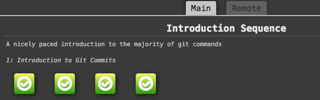
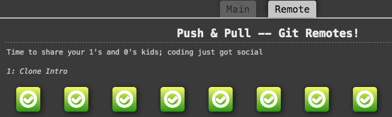

 # kottans-frontend

 ## Stage 0. Self-Study

 General
 
- [x] 0.Git Basics
- [ ] 1.Linux CLI and Networking
- [ ] 2.VCS (hello gitty), GitHub and Collaboration

 Front-End Basics
 

- [ ] 3.Intro to HTML & CSS
- [ ] 4.Responsive Web Design
- [ ] 5.HTML & CSS Practice
- [ ] 6.JavaScript Basics
- [ ] 7.Document Object Model 

 Advanced Topics
 

- [ ] 8.Building a Tiny JS World (pre-OOP)
- [ ] 9.Object oriented JS 
- [ ] 10.OOP exercise 
- [ ] 11.Offline Web Applications 
- [ ] 12.Memory pair game 
- [ ] 13.Website Performance Optimization 
- [ ] 14.Friends App 

---

 ## General:
 ### 0.Git Basics

Before listening first and second weeks of curse [Introduction to Git and GitHub](https://www.coursera.org/learn/introduction-git-github) I listened another [course](https://m.youtube.com/watch?v=O00FTZDxD0o) from Bogdan Stashchuk . It is makes all easier. Also I used some GIT commands earlier in VS Code.

Screenshots of [Learn Git Branching](https://learngitbranching.js.org/?locale=en_US)
 

---