 # kottans-frontend

 ## Stage 0. Self-Study

 General
 

- [x] 0.Git Basics
- [x] 1.Linux CLI and Networking
- [x] 2.Git Collaboration

 Front-End Basics
 

- [x] 3.Intro to HTML & CSS
- [x] 4.Responsive Web Design
- [x] 5.HTML & CSS Practice
- [x] 6.JS Basics
- [ ] 7.Document Object Model 

 Advanced Topics
 

- [ ] 8.Building a Tiny JS World (pre-OOP)
- [ ] 9.Object oriented JS 
- [ ] 10.OOP exercise 
- [ ] 11.Offline Web Applications 
- [ ] 12.Memory pair game 
- [ ] 13.Website Performance Optimization 
- [ ] 14.Friends App 

---
 ## General:
 ---

 ## 0.Git Basics

Before listening first and second weeks of curse [Introduction to Git and GitHub](https://www.coursera.org/learn/introduction-git-github) I listened another [course](https://m.youtube.com/watch?v=O00FTZDxD0o) from Bogdan Stashchuk . It is makes all easier. Also I used some GIT commands earlier in VS Code.

Task Git collaboration
 

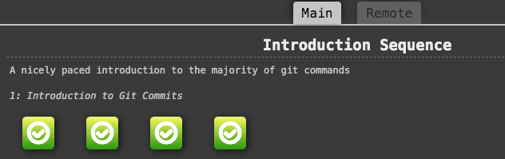
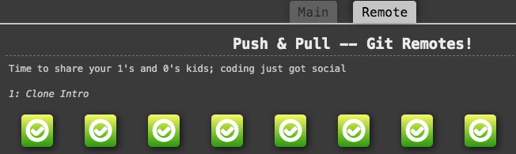

## 1.Linux CLI, and HTTP

Task Linux CLI
 

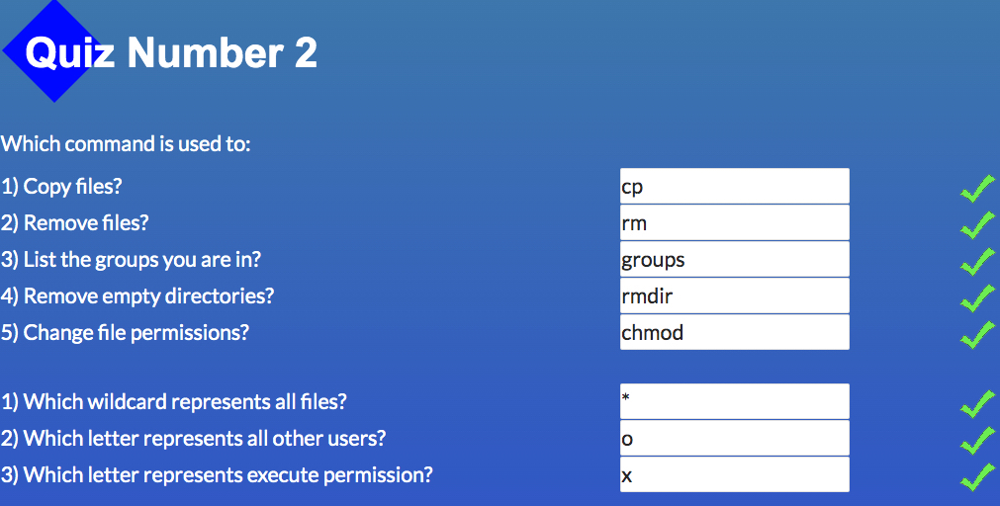
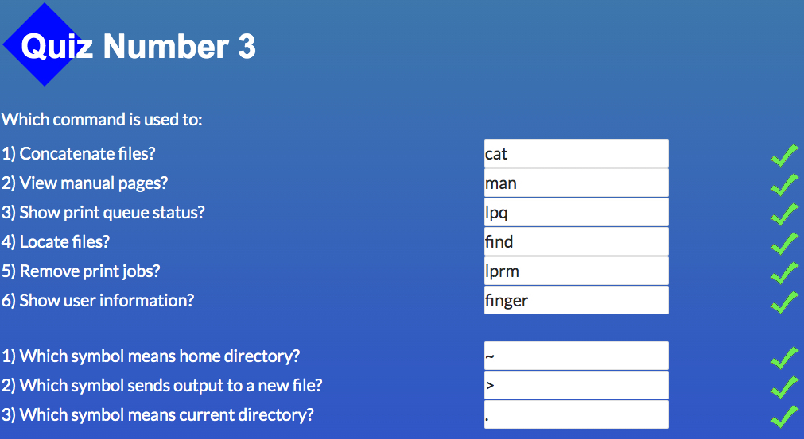
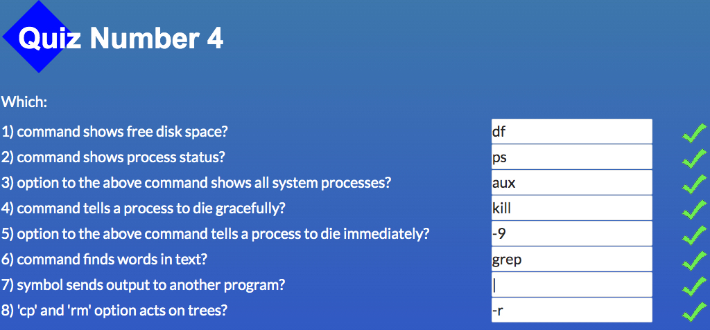

Actually earlier I used few of Linux commands, but [Linux Survival](https://linuxsurvival.com/linux-tutorial-introduction/) showed many useful commands in practice . I liked this tutorial.
What about HTTP it was hard for me to understanding all theory about working HTTP. But earlier I learned some theory and apply in practice some methods like GET, POST, PUSH, DELETE.

## 2.Git Collaboration

Task Git Collaboration
 

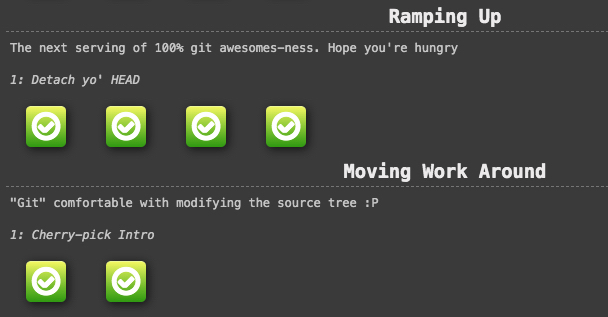
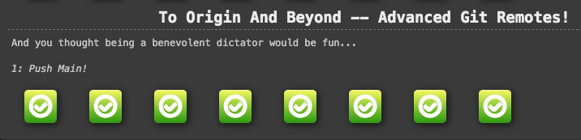

After listening third and fourth weeks of course [Introduction to Git and GitHub](https://www.coursera.org/learn/introduction-git-github) I write down some useful commands witch I will use in the feature. But I have to notice that this time it wos difficult to pass all levels in the game [Learn Git Branching](https://learngitbranching.js.org/?locale=en_US). So I will come back to it.

---
## Front-End Basics
---
## 3.Intro to HTML and CSS

Task HTML and CSS intro
 

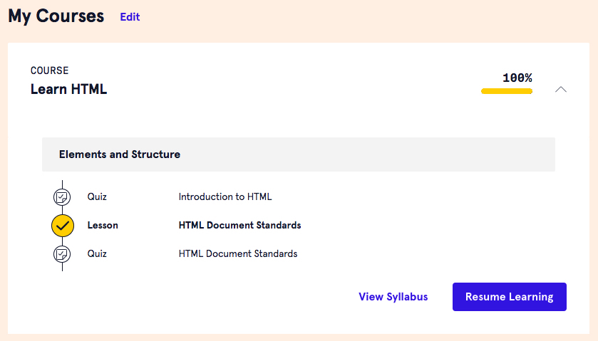
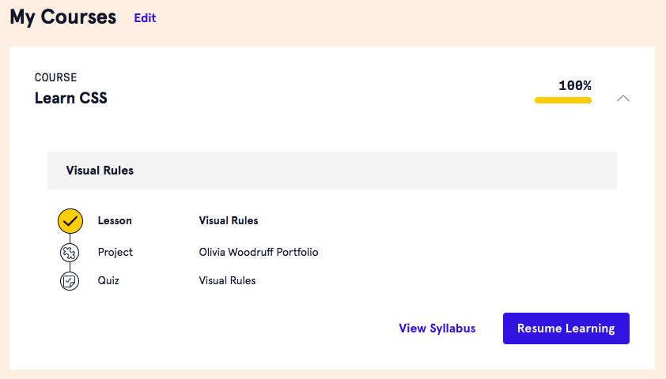

I really liked course of HTML and CSS from [Codecademy](https://www.codecademy.com/learn). It is easy for beginners to understand how work HTML and CSS on practice.
Actually some years ego I have a lot of practice with used HTML and CSS, for example I learned HTML code used design layout in this online [course](https://m.youtube.com/playlist?list=PLM6XATa8CAG4uCli-pMvuvwj46UaQoqIc).

## 4.Responsive Web Design

Task Responsive Web Design
 

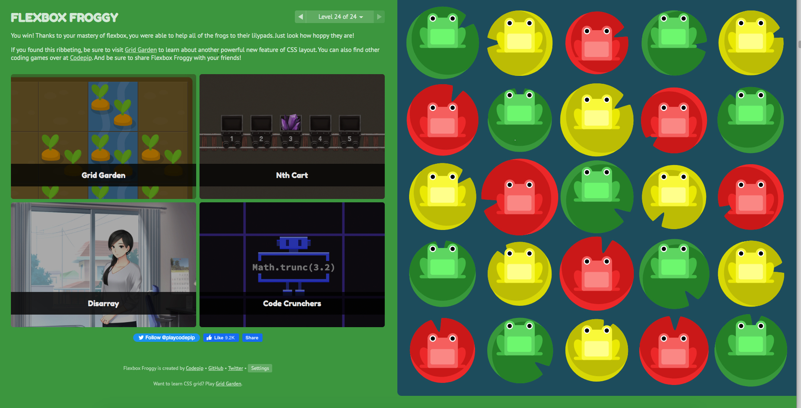
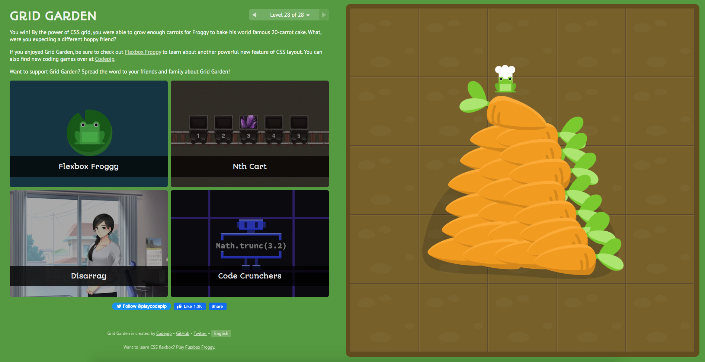

Corses of [Flexbox](https://m.youtube.com/playlist?list=PLM6XATa8CAG5mPV60dMmjMRrHVW4LmV2x) and [Grid](https://m.youtube.com/watch?v=GV92IdMGFfA&list=PLM6XATa8CAG5pXQrW_kDaeZb_uIAMNZIm) I passed two years ago. But it was useful for me to recall the various nuances. And the most useful it is [short description](https://m.youtube.com/watch?v=GV92IdMGFfA&list=PLM6XATa8CAG5pXQrW_kDaeZb_uIAMNZIm) from "Фрілансер по життю" about different topics, includes Flexbox and Grid. Also two years ago I passed games [Flexbox froggy](http://flexboxfroggy.com/) and [Grid garden](http://cssgridgarden.com/).

## 5.HTML & CSS Practice

[Demo](https://yhorodechna.github.io/html-css-popup/)

It was an interesting experience with using tag input for popup. Also I saw my mistakes and understand how to correct them.

## 6.JS Basics

Task JS Basics
 

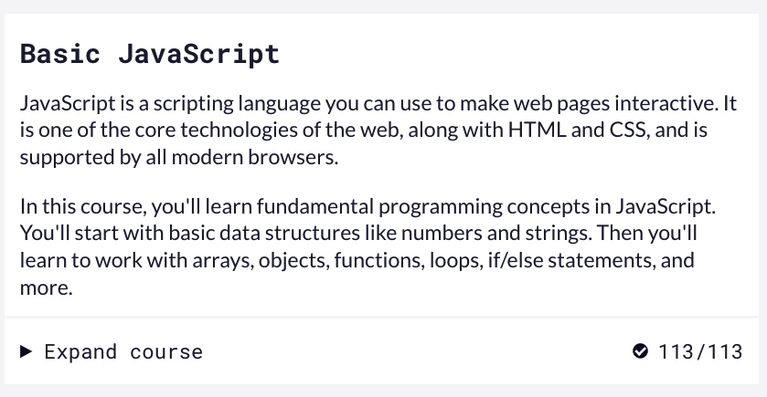
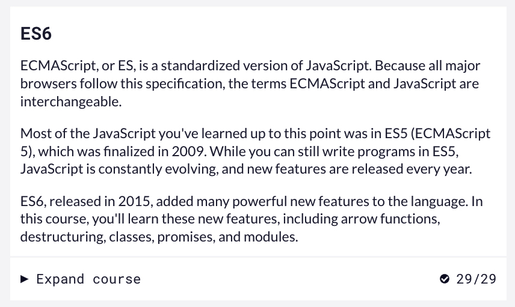
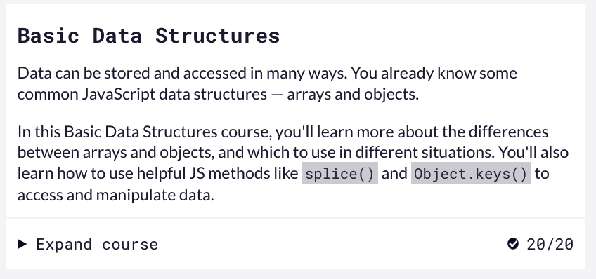
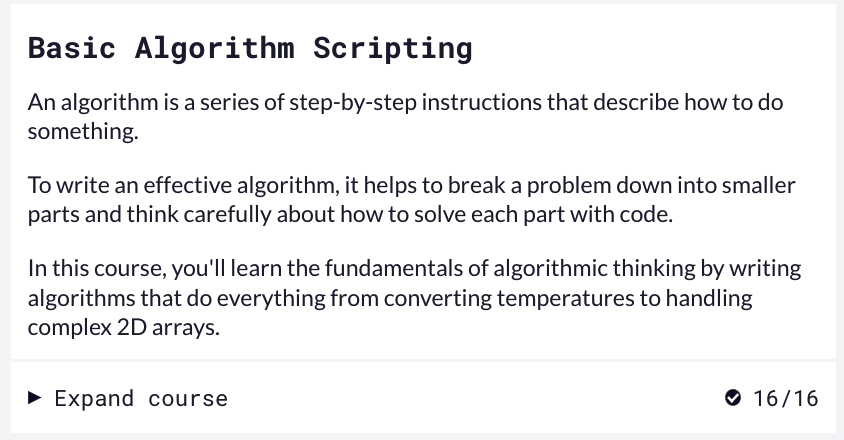
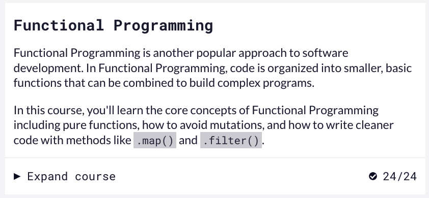
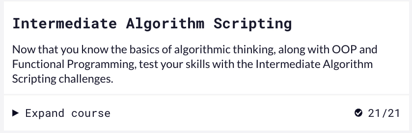

I used JS earlier. It was useful to to recall some methods of arrays and other topics. Also I write down some unknown to me thinks. I must note that it was very hard for me to dy all tasks from Intermediate Algorithm Scripting... Only at the time of this writing, I read that it was necessary to do only the first eleven tasks. So, it was hard but useful for me.

---