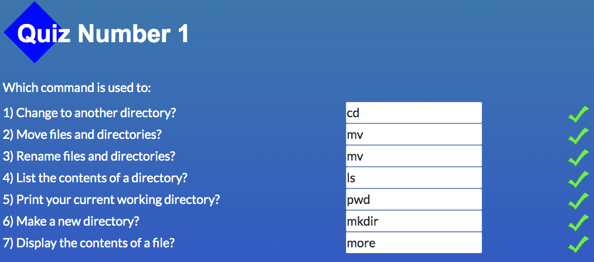

 # kottans-frontend

 ## Stage 0. Self-Study

 General
 

- [x] 0.Git Basics
- [x] 1.Linux CLI and Networking
- [x] 2.Git Collaboration

 Front-End Basics
 

- [x] 3.Intro to HTML & CSS
- [ ] 4.Responsive Web Design
- [ ] 5.HTML & CSS Practice
- [ ] 6.JavaScript Basics
- [ ] 7.Document Object Model 

 Advanced Topics
 

- [ ] 8.Building a Tiny JS World (pre-OOP)
- [ ] 9.Object oriented JS 
- [ ] 10.OOP exercise 
- [ ] 11.Offline Web Applications 
- [ ] 12.Memory pair game 
- [ ] 13.Website Performance Optimization 
- [ ] 14.Friends App 

---

 ## General:
 ## 0.Git Basics

Before listening first and second weeks of curse [Introduction to Git and GitHub](https://www.coursera.org/learn/introduction-git-github) I listened another [course](https://m.youtube.com/watch?v=O00FTZDxD0o) from Bogdan Stashchuk . It is makes all easier. Also I used some GIT commands earlier in VS Code.

Task Git collaboration
 

## 1.Linux CLI, and HTTP

Task Linux CLI
 

Actually earlier I used few of Linux commands, but [Linux Survival](https://linuxsurvival.com/linux-tutorial-introduction/) showed many useful commands in practice . I liked this tutorial.
What about HTTP it was hard for me to understanding all theory about working HTTP. But earlier I learned some theory and apply in practice some methods like GET, POST, PUSH, DELETE.

## 2.Git Collaboration

Task Git Collaboration
 

After listening third and fourth weeks of course [Introduction to Git and GitHub](https://www.coursera.org/learn/introduction-git-github) I write down some useful commands witch I will use in the feature. But I have to notice that this time it wos difficult to pass all levels in the game [Learn Git Branching](https://learngitbranching.js.org/?locale=en_US). So I will come back to it.

## Front-End Basics

## 3.Intro to HTML and CSS

Task HTML and CSS intro
 

I really liked course of HTML and CSS from [Codecademy](https://www.codecademy.com/learn). It is easy for beginners to understand how work HTML and CSS on practice.
Actually some years ego I have a lot of practice with used HTML and CSS, for example I learned HTML code used design layout in this online [course](https://m.youtube.com/playlist?list=PLM6XATa8CAG4uCli-pMvuvwj46UaQoqIc).

---